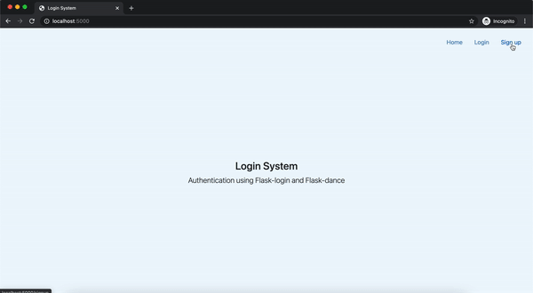
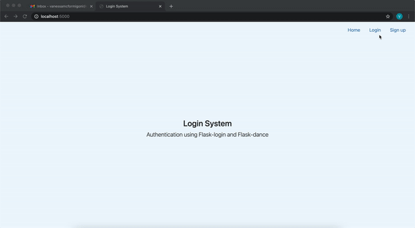
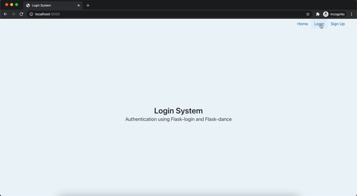
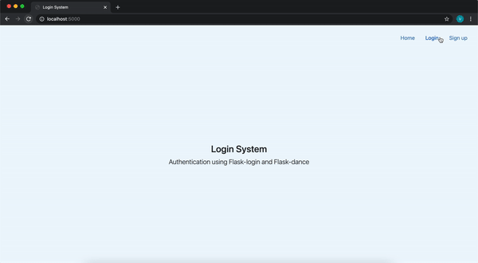

# Login System

A Login system made entirely with Python using Flask login, Flask Dance and Flask Mail. In this project the user is able to **Sign up**, **Sign in with email**, **Reset password** and **Sign in with Github, Google, or Facebook**.

## Demo

### Sign up and Login with email:

### Forgot password:

### Sign in with GitHub:

### Sign in with Google:

### Sign in with Facebook:

## Getting Started

These instructions will get you a copy of the project up and running on your local machine for development and testing purposes.

## Installing

**Clone this repository**: `https://github.com/vanessamcf/login_system.git`

**Go into the repository**: `cd login_system`

**Install environment**: 

     python3 -m pip install --user --upgrade pip
     python3 -m pip install --user virtualenv
     python3 -m venv env

**Enable virtual environment**: `source env/bin/activate `

**Install packages**: `pip install -r requirements.txt`

**Create db**: 

     python3
     from project import db, create_app
     db.creaye_all(app=create_app())
     exit()

## Create your project inside Github/Google and Facebook Developer:

### [Github](https://github.com/settings/developers):

1- Settings -> Developer settings -> OAuth Apps -> New OAuth App

2- Include **Application name** of your preference

3- Include **Homepage URL**: `http://127.0.0.1:5000/`

4- Include **Authorization callback URL**: `http://localhost:5000/login/github/authorized`

5- Register application

6- Copy your **Client ID** and **Client Secret**

7- Inside the Project go to `social_login.py` line 12

8- Paste the **Client ID** where is `'YOUR CLIENT ID'`

9- Paste the **Client Secret** where is `'YOUR CLIENT SECRET'`

### [Google](https://console.developers.google.com/apis/):

1- Settings -> New Project

2- Include **Project name** of your preference

3- APIs & Services -> OAuth consent screen

4- Select External and Create

5- Include **App name** of your preference

6- Select your **User support email**

7- **Developer contact information**: Include your email then Save and Continue

8- If you want you can skip: Scopes and Test users tapping Save and Continue

9- After filled OAuth consens screen, go to **Credentials** 

10- Create Credentials -> OAuth client ID

11- Select application type **Web application**

12- Update **Name** of the application 

13- Authorized JavaScript origins -> ADD URI: `http://127.0.0.1:5000` 

14- Authorized redirect URIs -> ADD URI: `http://localhost:5000/login/google/authorized` 

15- Create

15- Copy your **Client ID** and **Client Secret**

16- Inside the Project go to `social_login.py` line 14

17- Paste the **Client ID** where is `'YOUR CLIENT ID'` 

18- Paste the **Client Secret** where is `'YOUR CLIENT SECRET'`

### [Facebook](https://developers.facebook.com/?locale=en_US):

1- My Apps -> Create App -> Something Else -> Continue

2- Include your **App Display Name** -> Create App

3- Settings -> Basic

4- Include **App Domains**: `localhost`

5- Add Platform (at the bottom) -> Website

6- Include **Site URL**: `http://localhost:5000/login/facebook/authorized`

7- Save Changes

8- Copy your Client ID and Client Secret

9- Inside the Project go to `social_login.py` line 21

10- Paste the **Client ID** where is `'YOUR CLIENT ID'` 

11- Paste the **Client Secret** where is `'YOUR CLIENT SECRET'`

## Configure Google account (Forgot password functionality):

1 - Go into your Google account -> Manage your Google Account -> Security -> Less secure app access -> Turn on access -> Allow less secure app 

2- After Allow less secure app to have access, go to the `__init__.py` 

3- Update the lines 22 and 23 with your email and password where is `username@gmail.com` and `password` 

       app.config['MAIL_USERNAME'] = 'username@gmail.com'
       app.config['MAIL_PASSWORD'] = 'password'

4- Save the file and go to `auth.py`

5- Update the line 37 with your email where is `username@gmail.com`

      msg.sender = 'username@gmail.com'
      

### Run the application: 

- Terminal: `flask run`

## Acknowledgments

* [Tutorial - How To Add Authentication to Your App with Flask-Login](https://www.digitalocean.com/community/tutorials/how-to-add-authentication-to-your-app-with-flask-login)
* [Repository - flask-dance-multi-provider](https://github.com/singingwolfboy/flask-dance-multi-provider/tree/master/app)
* [Integrating Flask-Dance With Flask-Login and Flask-SQLAlchemy (Part 2)](https://www.youtube.com/watch?v=G44Tpi58dcc&t=282s)
* [Password Reset with Flask-Mail Protocol](https://medium.com/@stevenrmonaghan/password-reset-with-flask-mail-protocol-ddcdfc190968)
* [Repository - code_snippets](https://github.com/CoreyMSchafer/code_snippets/tree/master/Python/Flask_Blog/10-Password-Reset-Email/flaskblog)
